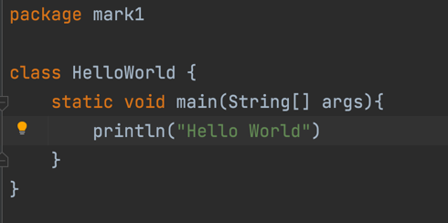
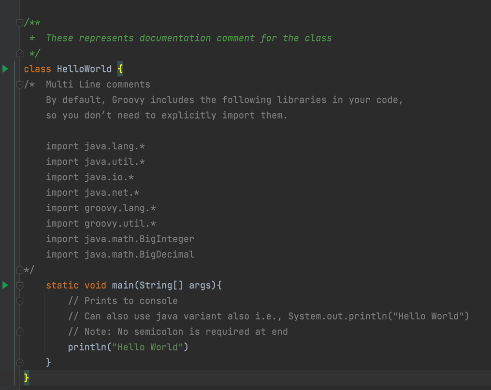
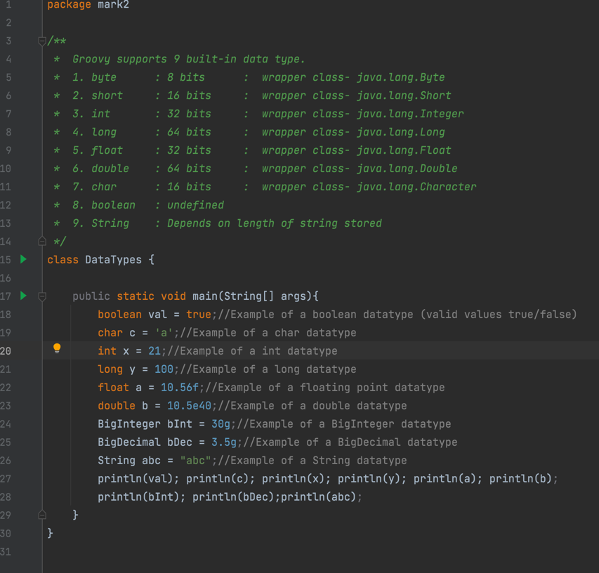
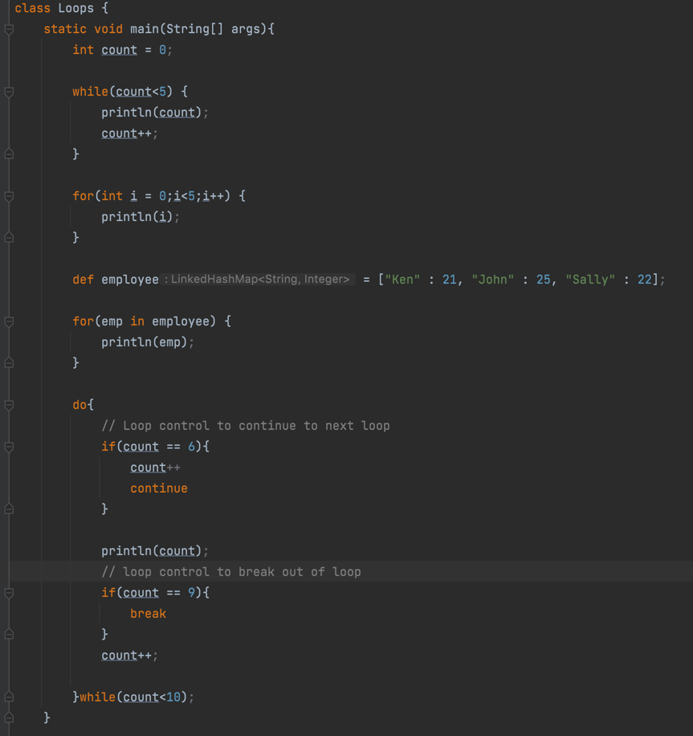

# Learning Groovy

Groovy is an object-oriented programming language  
based on Java platform.

Groovy is distributed via the Apache License v 2.0. In this tutorial, we would explain all the fundamentals of Groovy and how to put it into practice.  

## Prerequisites
This tutorial requires prior knowledge of Java.

## Features of Groovy
Groovy has the following features:
1. Support for both static and dynamic typing.
2. Support for operator overloading.
3. Native syntax for lists and associative arrays.
4. Native support for regular expressions.
5. Native support for various markup languages such as XML and HTML.
6. Groovy is simple for Java developers since the syntax for Java and Groovy are very similar.
7. You can use existing Java libraries.
8. Groovy extends the java.lang.Object.

## First Groovy Program

## Comments in Groovy

There are 3 types of comments in groovy.  
1. Single line comments (Followed by double forward slag in the image).    
   1. Everything following '//' is considered as a comment.  
   2. Only the characters following '//' in the same line is considered as a comment.    
2. Multi line comments (Enclosed between '/*' and '\*/')  

## Data Types
  
Groovy supports for 9 data built-in data types.  
However, the last type 'String' is an object  

The size and a sample usage is shown in the pic above.  

*Please note that the BigDecimal, BigInteger, String are immutable i.e., their values cannot be changed.    
When the values of these are modified an entirely new object is created and returned with the result of the manipulation.*

## Operators

Groovy supports below list of operators  

1. Arithematic Operators:  
   a. +   : Add two operands  
   b. -   : Subtract two operands  
   c.    : Multiply two operands  
   d. /   : Divide two operands  
   e. %   : Remainder of division of two operands  
   f. ++  : Increment value by one (post and pre)  
   g. --  : Decrement value by one (post and pre)
  

2. Relational Operators:  
   a. a==b  : is a equal to b  
   b. a!=b  : is a not equal to b  
   c. a<b   : is a less than b  
   d. a<=b  : is a less than or equal to b  
   e. a>b   : is a greater than b  
   f. a>=b  : is a greater than or equal to b  
  

3. Logical Operators:  
   a. && : AND (SHORT CIRCUIT AND)  
   b. || : OR (SHORT CIRCUIT OR)  
   c: !  : NOT (NEGATE)
  

4. Bitwise Operator:  
   a. & : Bitwise AND  
   b. | : Bitwise OR  
   c. ^ : Bitwise Ex-OR  
   d. ~ : Bitwise NEGATE  
  

5. Assignment Operator  
   a. += : [ a+=b => a=a+b ]  
   b. -= : [ a-=b => a=a-b ]  
   c. *= : [ a*=b => a=a*b ]  
   d. /= : [ a/=b => a=a/b ]  
   e. %= : [ a%=b => a=a%b ]  
  

6. Range Operator:  
   a.  .. : 0..5 = [0,1,2,3,4,5]  
 
## Loops
  

In the image you can see 4 types of loops, namely:
1. while loop  
2. for loop
3. for-in loop (This also depicts the dynamic typing capability of groovy)
4. do-while loop

## File I/O

[File IO ReadMe](src/mark5/ReadMe.md)